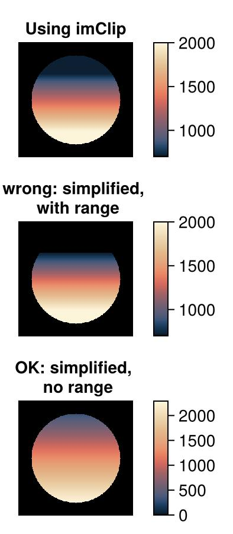

# qMRIColors

[](https://atrotier.github.io/qMRIColors.jl/stable/)
[](https://atrotier.github.io/qMRIColors.jl/dev/)
[](https://github.com/atrotier/qMRIColors.jl/actions/workflows/CI.yml?query=branch%3Amain)
[](https://codecov.io/gh/atrotier/qMRIColors.jl)


Julia package of https://github.com/mfuderer/colorResources

<p>This package goes with the guideline paper published in Magnetic Resonance in Medicine, https://doi.org/10.1002/mrm.30290, <em> Color-map recommendation for MR relaxomtry maps </em>.</p>
<p>It is to be used to display quantitative maps of T1, R1, T2, R2, T2*, R2*, T1rho and R1rho.</p>
<p>The package contains the Lipari color map, the Navia color map as well as the logarithm-processing as referred to by the publication.</p>

<p>In essence, following commands are needed: </p>

```@example 1
# x is the image to be displayed, (loLev,upLev) is the relevant range of the values 
# we take T1 as an example
using qMRIColors
cmap,imClip = relaxationColorMap("T1",x,loLev,upLev)
VIEW(imClip,c=cmap,clim=(loLev,upLev)) 
```
<p>In the above, "VIEW" refers to your favorite viewing software (CairoMakie, Plots, PyPlot, ...)</p>
<p>The relaxationColorMap() function selects the appropriate color-map (in this case, Lipari for T1) and applies logarithm-processing on that color map. The resulting colormap is returned.</p>
<p>The "imclip" image should retain the distinction between the "invalid" value of 0 (which is to be displayed as black) and "valid" values that are below loLev (these should be shown in a dark shade of blue). Depending on the calibration of your screen, you may or may not see that distinction.</p>
<p><br>A simplified processing can be done by</p>

```@example 2
using qMRIColors
cmap = relaxationColorMap("T1")
VIEW(x,c=cmap) # Do not use range limits here! 
```
<p>Again, "VIEW" refers to your favorite viewing software.</p>
<p><br>If the simplified processing is invoked WITH use of range limits, then the 
distinction is lost between invalid values and low-but-valid values. See second image in the 
example below: it represents a circular object with a T1 value that is gradually increasing
from top to bottom, but only valid within a circular "object", the outside thereof representing 
unknown T1 values. </p>

